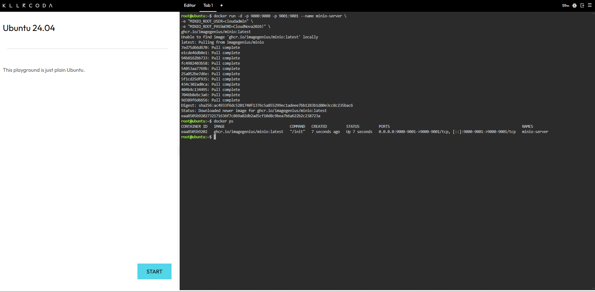
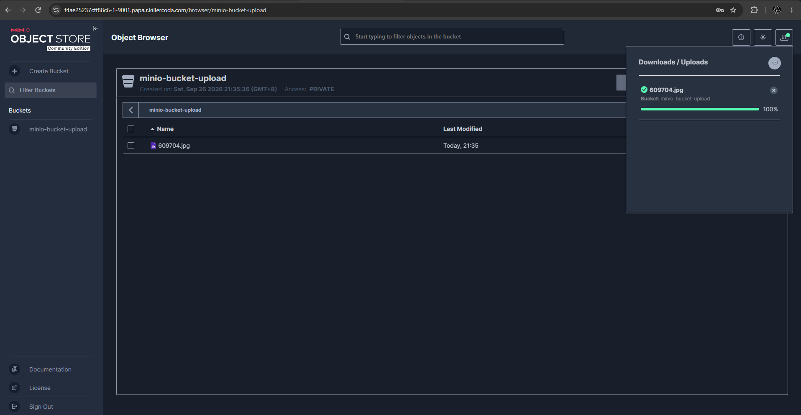

# 🗄️ MinIO Deployment Log

## 🐳 Docker Command Used

The official `minio/minio` image is no longer available on Docker Hub, since MinIO discontinued free Docker Hub distribution in late 2025. A working community-maintained alternative was used instead:

```bash
docker run -d -p 9000:9000 -p 9001:9001 --name minio-server \
-e "MINIO_ROOT_USER=cloudadmin" \
-e "MINIO_ROOT_PASSWORD=CloudNova2026!" \
ghcr.io/imagegenius/minio:latest
```

## 🔌 Port Used to Access the Web Console

Port `9001` was used to access the MinIO Web Console, accessed through KillerCoda's Traffic Port Accessor by entering `9001` and clicking Access.

## 🪣 Bucket Created

A bucket named `client-photos` was created through the MinIO Web Console, then a sample image file was uploaded to it to verify the storage server was working end to end.

## 🔧 What the `-e` Flags Did

The `-e` flags set environment variables inside the container at startup:

- `-e "MINIO_ROOT_USER=cloudadmin"` set the admin username used to log into the MinIO Web Console and authenticate API requests.
- `-e "MINIO_ROOT_PASSWORD=CloudNova2026!"` set the admin password paired with that username.

Both credentials were required to log into the web console and were passed directly into the container rather than being configured after the fact, which is the standard way Docker containers receive runtime configuration without needing to modify the image itself.

## 📸 Evidence



